# Gaussian Mixture Model with Expectatoin Maximization Algorithm

please see a implementation in GMM.ipynb

|model| num of gauss dist. | convtype | params|end epoch \(thresh=1e-3)|log_likelihood|BIC |
|:---:|:---:    |:---:     |:---:  |:---:                 |:---:         |:---:|   
|K1_diag0| 1 | full | 6|2|-7699.809|15435.840|
|K1_diag1| 1 | diag | 5|2|-9274.189|18577.356|
|K2_diag0| 2 | full | 12|15|-6152.370|12377.182|
|K2_diag1| 2 | diag | 10|7|-6884.938|13827.830|
|**K3_diag0**| 3 | full | 18|24|-5451.755|**11012.173**|
|K3_diag1| 3 | diag | 15|9|-5702.959|11492.849|
|K4_diag0| 4 | full | 24|29|-5448.348|11041.580|
|K4_diag1| 4 | diag | 20|29|-5700.893|11517.694|
|K4_diag0| 5 | full | 30|29|-5446.084|11073.273|
|K5_diag1| 5 | diag | 25|29|-5699.974|11544.833|

## BIC to K size
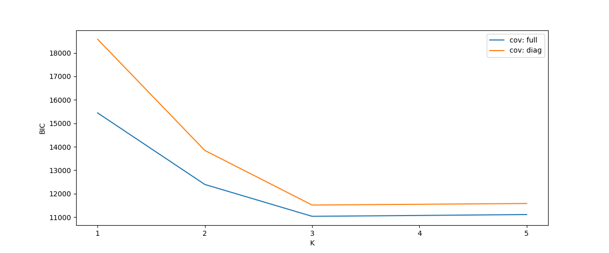

## K1_diag0
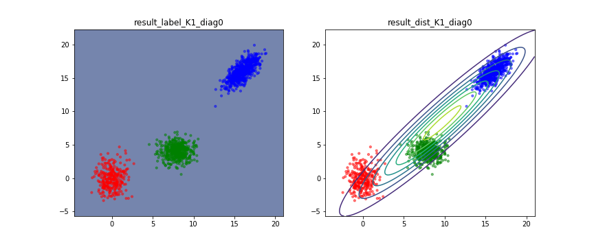
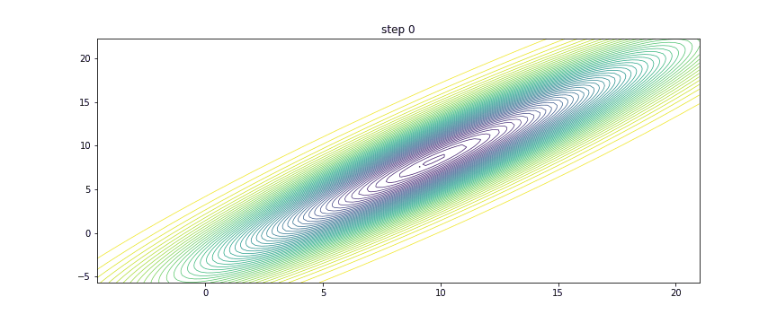
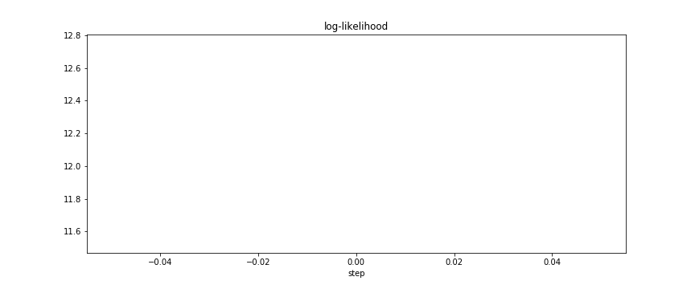

## K1_diag1
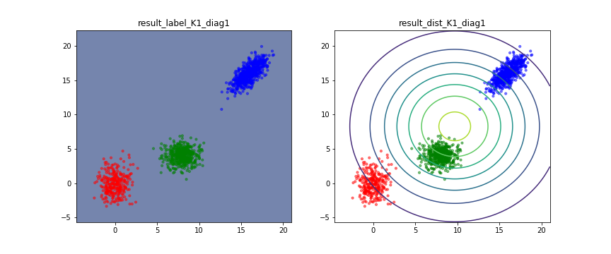
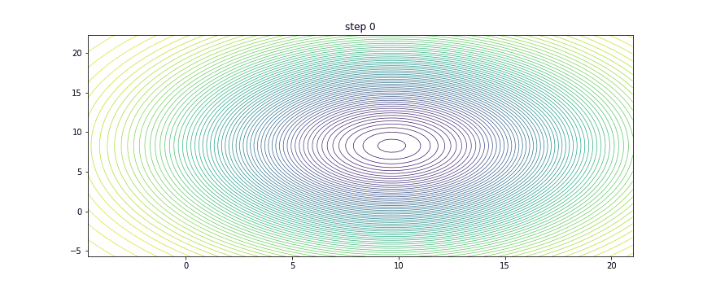
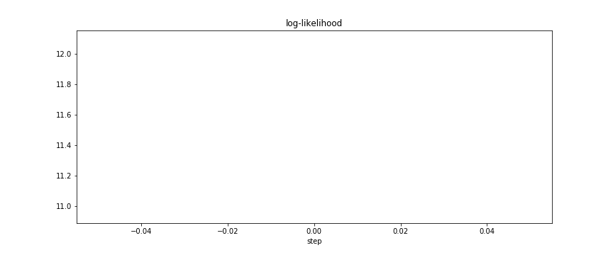

## K2_diag0
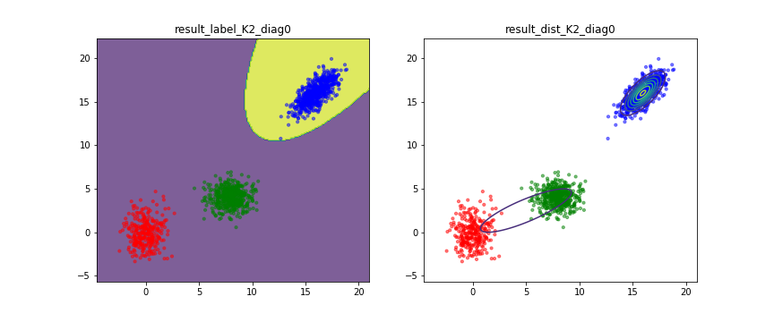
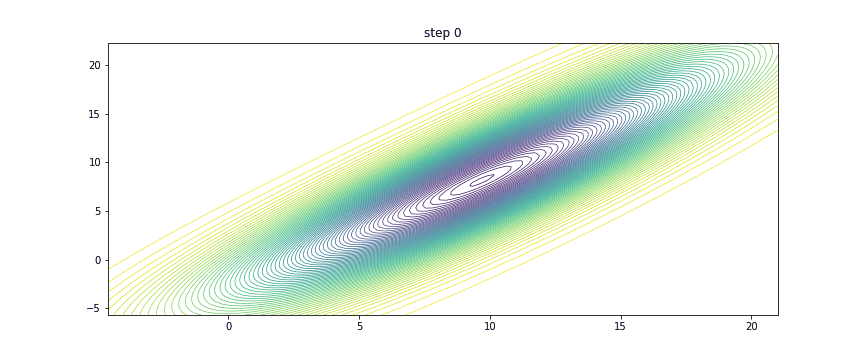
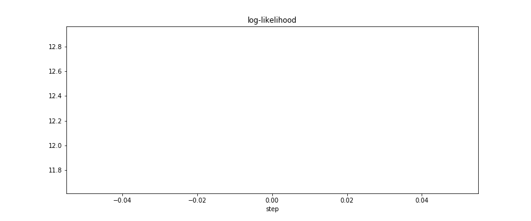

## K2_diag1
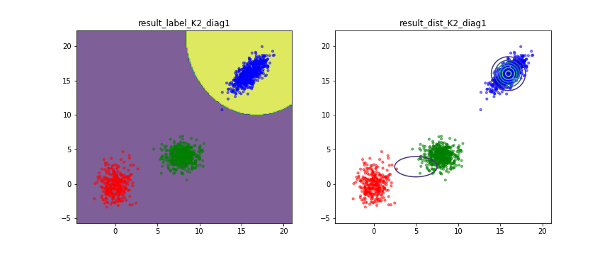
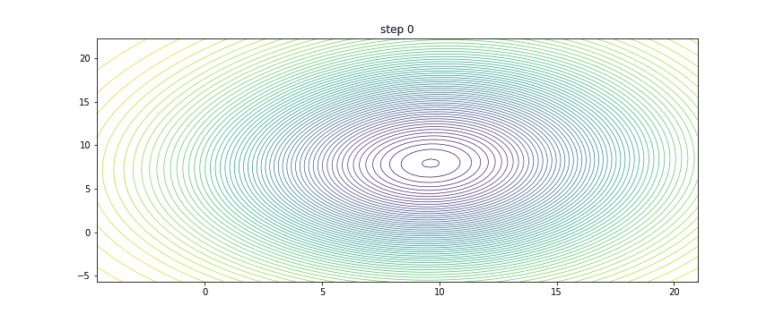
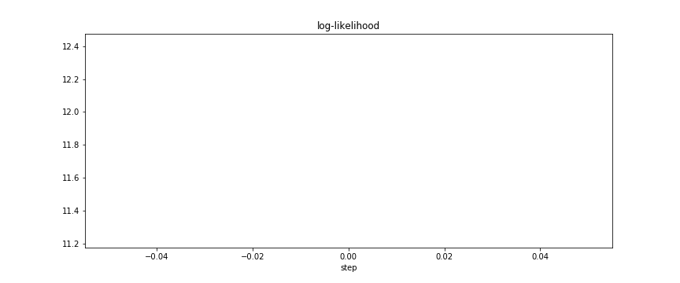

## K3_diag0
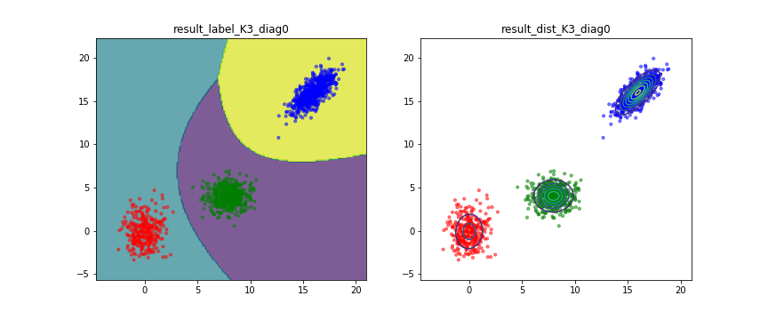
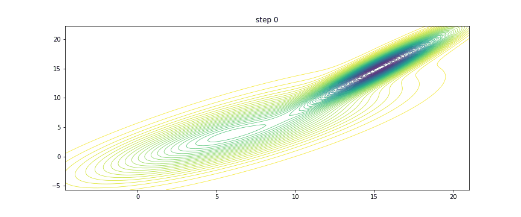
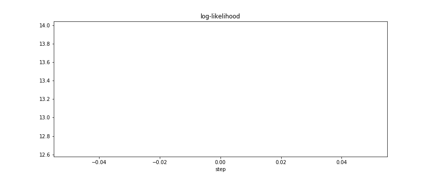

## K3_diag1
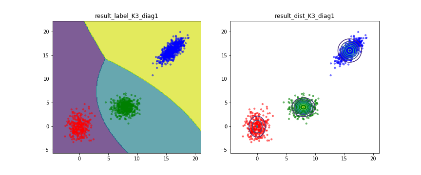
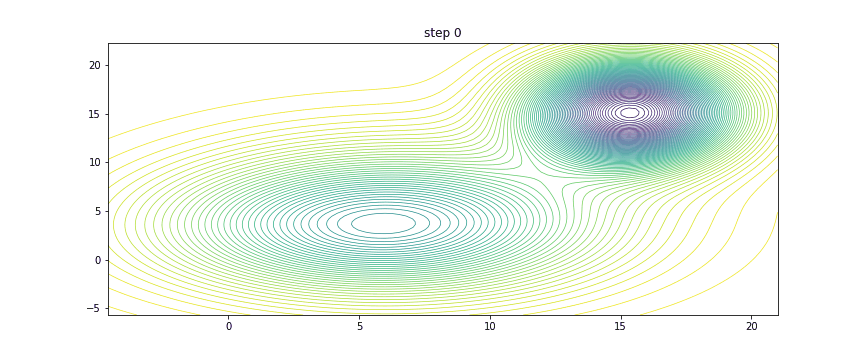
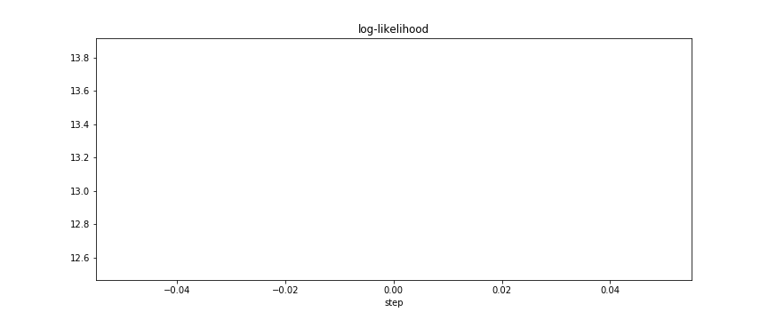

## K4_diag0
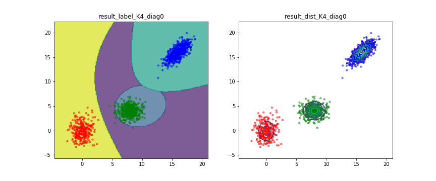
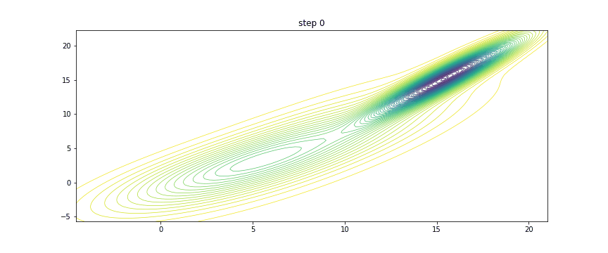
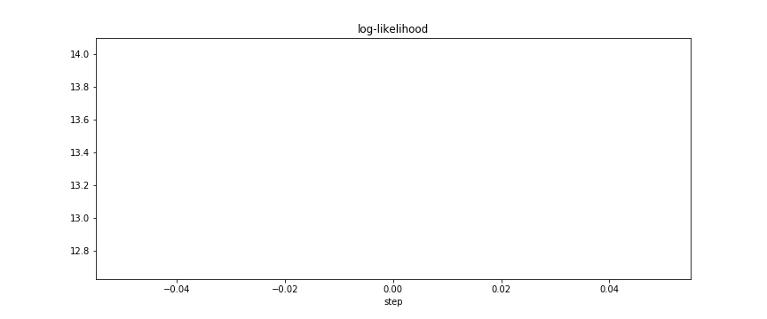

## K4_diag1
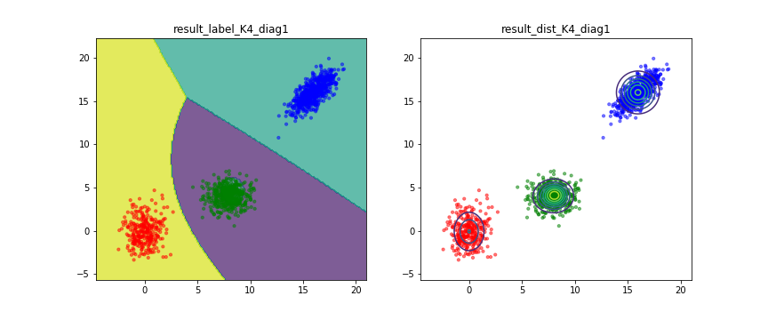

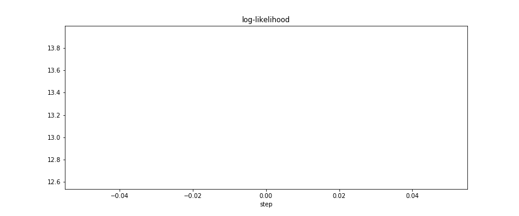

## K5_diag0
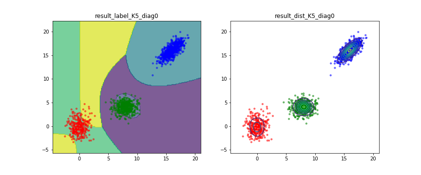

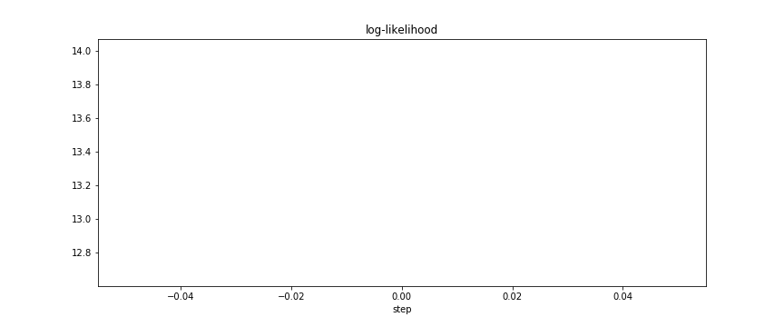

## K5_diag1
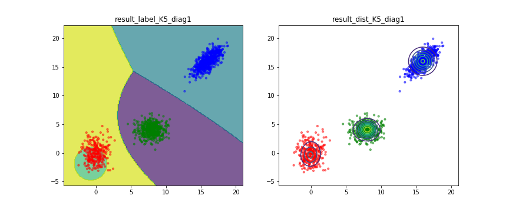
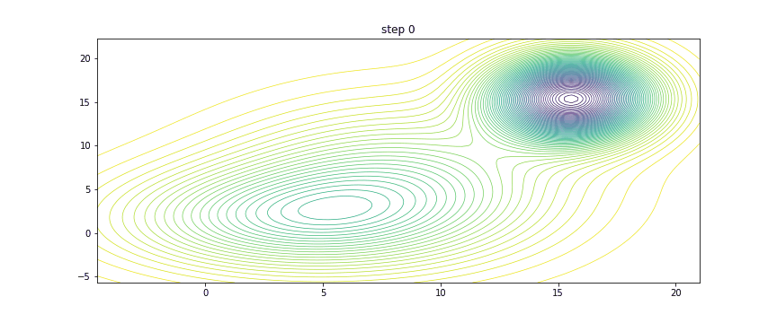
